<div align="center">


# OHcode

**让 HarmonyOS PC 拥有更得心应手的代码编辑体验**

[](https://developer.huawei.com/consumer/cn/harmonyos/)
[](https://developer.huawei.com/consumer/cn/arkts/)
[](https://isocpp.org/)
[](https://git-lfs.github.com/)
[](./LICENSE)

_将 Electron / VS Code 移植到鸿蒙桌面设备——不仅仅是「能跑」，而是「好用」。_

</div>

---

## 📖 目录

- [✨ 项目愿景](#-项目愿景)
- [🏗️ 架构总览](#️-架构总览)
- [🧩 模块详解](#-模块详解)
  - [web_engine — 引擎核心](#web_engine--引擎核心)
  - [electron — 应用入口](#electron--应用入口)
  - [Embedded Wasmer Runtime](#embedded-wasmer-runtime)
- [🚀 快速开始](#-快速开始)
- [🛠️ 开发指南](#️-开发指南)
  - [项目结构](#项目结构)
  - [添加新的 Adapter](#添加新的-adapter)
  - [Wasmer 运行时配置](#wasmer-运行时配置)
  - [HNP 打包与注入](#hnp-打包与注入)
  - [文件关联与打开方式](#文件关联与打开方式)
  - [代码风格与约定](#代码风格与约定)
- [📡 通信机制](#-通信机制)
- [🔐 权限说明](#-权限说明)
- [⚠️ 已知限制与安全注意](#️-已知限制与安全注意)
- [🗺️ 路线图](#️-路线图)
- [🤝 参与贡献](#-参与贡献)

---

## ✨ 项目愿景

OHcode 的目标是让 HarmonyOS 2in1 / 平板设备上的开发者**无需离开鸿蒙生态**，就能获得完整的 VS Code 编辑体验：

| 🎯 目标 | 💡 实现方式 |
|---------|-----------|
| **原生编辑体验** | Chromium/Electron 引擎直接在 HarmonyOS 上渲染，XComponent 承载原生窗口 |
| **轻量 WebAssembly 工具链** | Wasmer C API 在 HarmonyOS 进程内运行 WASI/WASIX 模块 |
| **鸿蒙系统整合** | 37+ Adapter 桥接 Electron API → HarmonyOS 系统 API |
| **文件管理器联动** | 「用 OHcode 打开」直接关联 28+ 文件类型 |
| **扩展生态兼容** | 基于 VS Code 1.85.2，兼容 Open VSX 扩展市场 |

---

## 🏗️ 架构总览

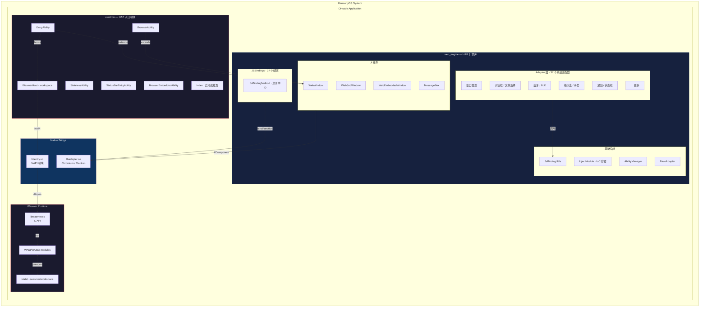

**核心思路**：`web_engine` 封装 Chromium 渲染 + 37 个系统适配器，作为 HAR 供 `electron` 入口模块引用；`electron` 额外初始化 Wasmer C API，在鸿蒙原生进程内运行 WASI/WASIX 模块，不再启动 Linux/QEMU guest。

---

## 🧩 模块详解

### web_engine — 引擎核心

`web_engine` 是可复用的 HAR 库，包含在 HarmonyOS 上运行 Chromium/Electron 所需的全部适配逻辑。它是一个**自包含的引擎层**——理论上任何鸿蒙应用都可以引用它来获得基于 Chromium 的窗口渲染能力。

#### 对外 API

`web_engine` 通过 `Index.ets` 导出以下公共接口，应用层只需关心这些类型：

| 导出项 | 类型 | 说明 |
|--------|------|------|
| `WebAbilityStage` | Class | Ability 生命周期管理，最早初始化入口——在此处引导 NativeContext 和全部 JS 绑定 |
| `WebAbility` | Class | 主窗口 Ability 基类，处理窗口创建、参数传递、主题切换、权限申请 |
| `WebEmbeddedAbility` | Class | 嵌入式 UI Extension Ability 基类，用于被其他应用嵌入展示 |
| `WebWindow` | Component | XComponent 原生渲染窗口，核心 UI 组件，承载 Chromium 渲染表面 |
| `WebSubWindow` | Component | 子窗口组件，用于弹出的辅助窗口 |
| `WebEmbeddedWindow` | Component | 嵌入式窗口组件，运行在 UIExtensionContentSession 中 |
| `WebWindowNode` | Component | NodeController 变体，适用于需要节点级管理的场景 |
| `ILoginInfo` / `ILogin` | Interface | 登录相关类型 |

#### Ability 层级体系

`web_engine` 定义了两条平行的 Ability 继承链，它们都实现 `WebProxy` 接口，使得 `AbilityManager` 可以统一管理：

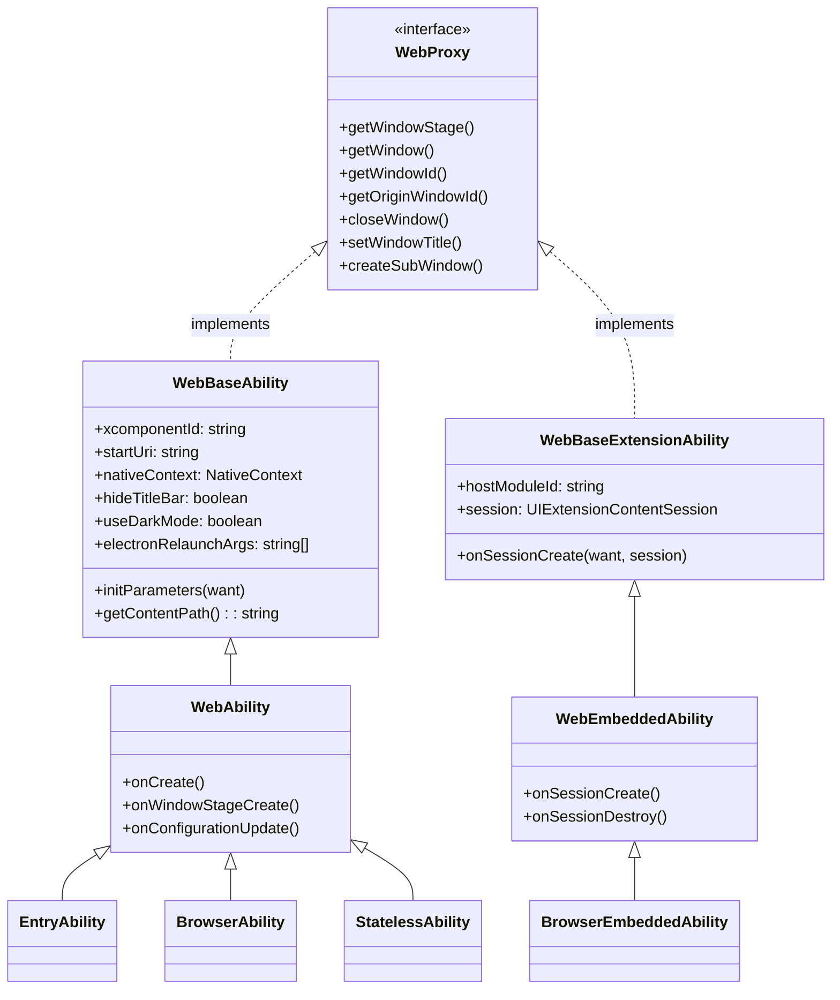

> 💡 **为什么两条链？** 鸿蒙有两种窗口形态：`UIAbility`（独立窗口）和 `EmbeddedUIExtensionAbility`（嵌入宿主应用窗口）。两条继承链确保无论是独立运行还是被嵌入，都能获得一致的 Chromium 渲染能力。

#### 适配器全景

37 个 Adapter 是 `web_engine` 的核心价值——它们将 Electron API 逐一映射到 HarmonyOS 原生能力：

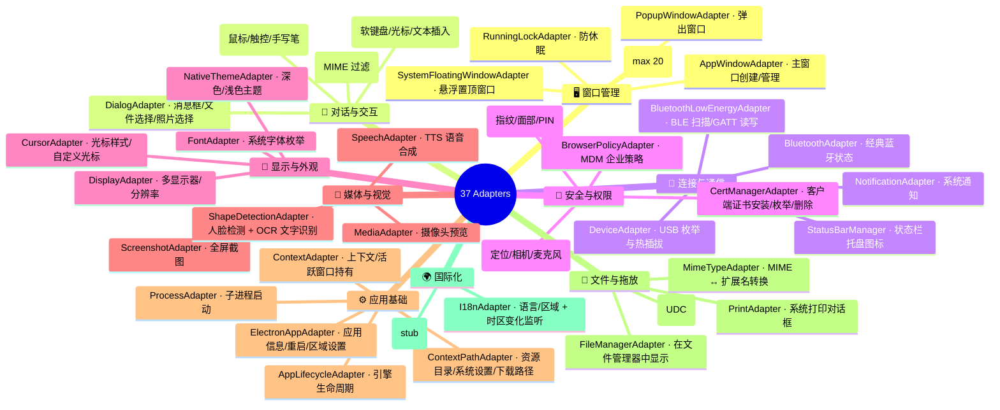

#### Native Bridge 流程

Chromium 引擎运行在 `libadapter.so` 中，它通过 `NativeContext` 对象与 ArkTS 层双向通信：

```mermaid
sequenceDiagram
    participant C as Chromium / libadapter.so
    participant NC as NativeContext
    participant JB as JSBindings
    participant AD as Adapters
    participant HO as HarmonyOS APIs

    Note over NC: 引擎启动时由 WebAbilityStage 初始化

    rect rgb(30, 30, 60)
        Note over C,HO: 正向调用 — ArkTS → Chromium
        WW->>NC: runBrowser(args)
        WW->>NC: ExecuteCommand(kNewWindow, {url})
        NC->>C: 执行 Chromium 命令
    end

    rect rgb(60, 30, 30)
        Note over C,HO: 反向回调 — Chromium → ArkTS
        C->>NC: 需要打开对话框
        NC->>JB: Dialog_ShowMessageBox(params)
        JB->>AD: DialogAdapter.showMessageBox()
        AD->>HO: AlertDialog.show()
        HO-->>AD: 用户点击
        AD-->>C: 返回结果
    end

    rect rgb(30, 60, 30)
        Note over C,HO: 绑定注册 — 启动时一次性
        JB->>NC: JSBind.bindFunction("Dialog_ShowMessageBox", fn)
        NC->>C: 注册回调句柄
    end
```

**关键对象 `NativeContext`** 提供的核心方法：

| 方法 | 方向 | 说明 |
|------|------|------|
| `runBrowser(args)` | ArkTS → C++ | 启动 Chromium 主循环，传入命令行参数 |
| `ExecuteCommand(type, params)` | ArkTS → C++ | 发送命令（新建窗口、打开 URL、退出等） |
| `JSBind.bindFunction(name, fn)` | ArkTS → C++ | 注册回调，让 C++ 侧可以调用 ArkTS 函数 |
| `OnWindowInitSize(rect, drawableRect)` | ArkTS → C++ | 通知窗口初始尺寸 |
| `OnWindowEvent(event)` | ArkTS → C++ | 通知窗口状态变化（最小化/最大化/关闭等） |
| `OnPanEventCB / OnPinchEventCB` | ArkTS → C++ | 转发触控手势事件 |

#### 依赖注入

`web_engine` 使用 Inversify IoC 容器管理所有 Adapter 的生命周期。这套机制保证了：

- **单例保证**：每个 Adapter 在整个应用中只存在一个实例
- **按需加载**：未使用的 Adapter 不会初始化（通过 `import lazy` 和 `getOrCreate` 实现）
- **松耦合**：组件间通过接口依赖，不直接引用具体实现

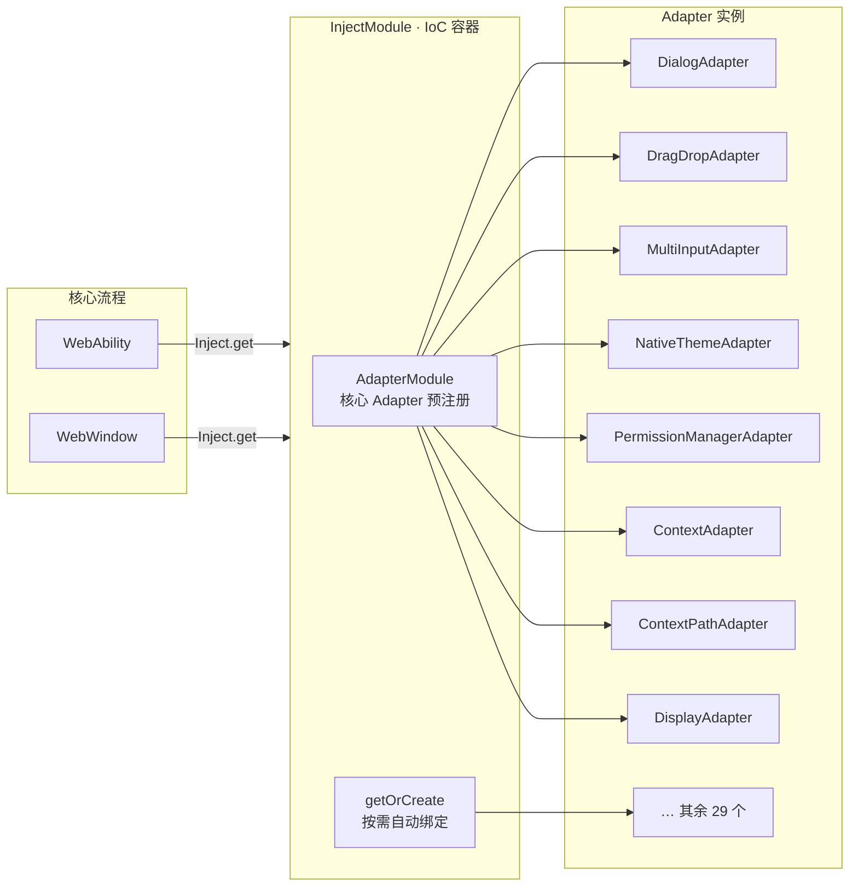

> 💡 **核心 vs 按需**：`AdapterModule` 预注册了 WebAbility/WebWindow 直接需要的 8 个 Adapter；其余 29 个通过 `Inject.getOrCreate()` 在首次被 JSBinding 使用时自动绑定。这样既保证了核心流程的确定性，又避免了不必要的初始化开销。

### electron — 应用入口

`electron` 是薄应用层，继承 `web_engine` 基类，添加 Wasmer 运行时初始化、文件关联处理和品牌加载页。

#### Ability 清单

| Ability | 基类 | 类型 | 说明 |
|---------|------|------|------|
| `EntryAbility` | `WebAbility` | UIAbility | 主入口。`onCreate` 初始化 Wasmer + 处理「用 OHcode 打开」；`onNewWant` 处理后续文件打开请求 |
| `BrowserAbility` | `WebAbility` | UIAbility | 浏览器窗口，使用 `pages/WindowNode`（NodeController 变体） |
| `StatelessAbility` | `WebAbility` | UIAbility | 无状态窗口，禁用系统窗口位置自动保存，使用 `pages/Index` |
| `StatusBarEntryAbility` | `StatusBarViewExtensionAbility` | ExtensionAbility | 状态栏扩展，加载 `pages/StatusBarPage`，独立于浏览器窗口体系 |
| `BrowserEmbeddedAbility` | `WebEmbeddedAbility` | ExtensionAbility | 嵌入式 UI 扩展，使 OHcode 可被其他应用嵌入展示 |

#### 启动流程

从用户点击图标到 VS Code 工作台就绪，整个流程如下：

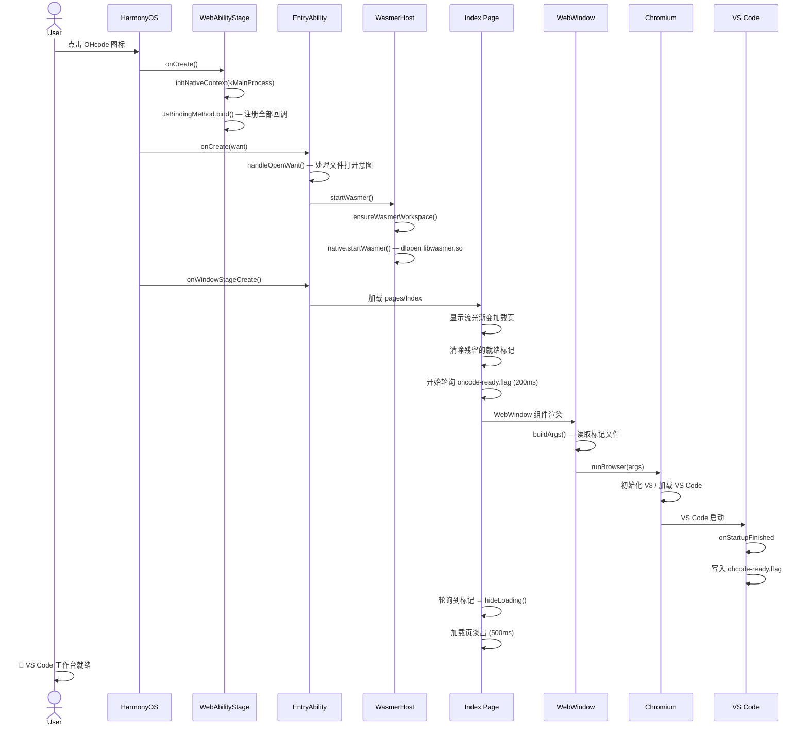

#### 加载页

`Index` 页面包含一个精心设计的启动加载页，确保用户在 VS Code 工作台就绪前看到品牌画面而非空白窗口：

- **视觉**：多层渐变 + blur 融合的流光溢彩效果，中央放置 OHcode logo + 品牌标语
- **就绪检测**：轮询 `ohcode-ready.flag` 标记文件（由 VS Code 扩展 `ohcode-splash` 在 `onStartupFinished` 时写入），200ms 间隔
- **兜底超时**：20 秒后强制隐藏，防止标记写入失败导致加载页常驻
- **淡出动画**：500ms `EaseInOut` 透明度过渡 + 轻微缩放

### Embedded Wasmer Runtime

OHcode 不再启动 Linux/QEMU 虚拟机。`EntryAbility` 初始化一个鸿蒙原生 Wasmer host，由 `libentry.so` 通过 `dlopen("libwasmer.so")` 加载 `Multi-V-VM/wasmer` 的 C API，并在应用进程内运行 WASI/WASIX 模块。

#### 启动链路

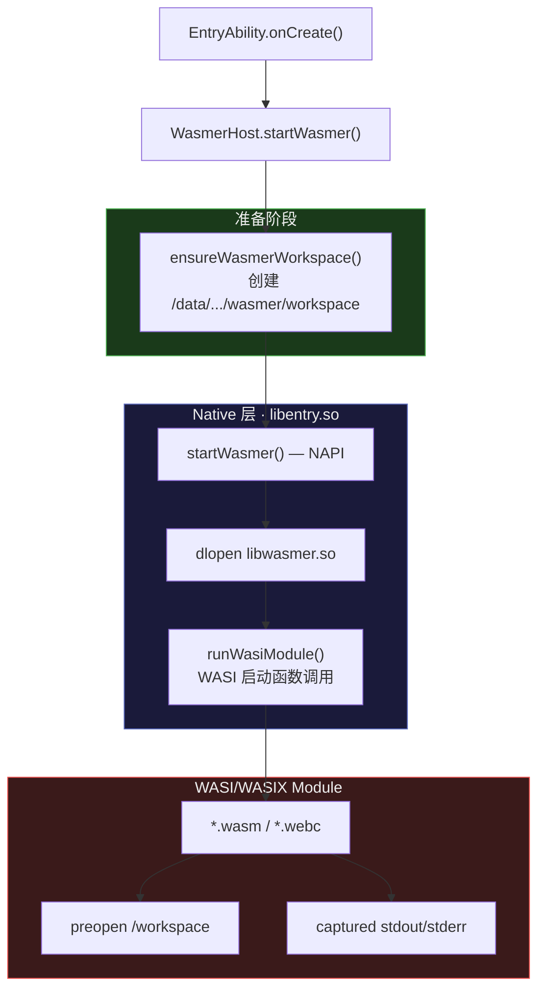

**关键设计决策**：

| 决策 | 原因 |
|------|------|
| Wasmer in-process | 避免鸿蒙应用启动外部 VM/进程，降低包体和启动成本 |
| 动态加载 `libwasmer.so` | 应用可在没有 Wasmer 产物时继续启动，便于分阶段替换 |
| 默认 Wasmer WAMR 后端 | 使用解释器路径，规避鸿蒙 JIT/可执行内存限制，同时避免 wasmi C API 符号重定位问题 |
| WASI preopen workspace | 模块只看到显式授权目录，替代原 guest 文件共享和 hostcmd 通道 |

#### 原生模块 (`libentry.so`)

| 文件 | 角色 |
|------|------|
| `wasmer_host.cpp` | NAPI 模块 `entry`。加载 Wasmer C API，暴露 `startWasmer()` / `isWasmerReady()` / `runWasiModule()` |
| `CMakeLists.txt` | 构建 `entry` 共享库（C++17，链接 `libace_napi`、`libhilog_ndk`、`dl`） |

#### Wasmer 产物

`libwasmer.so` 不随仓库提交。使用脚本从指定 fork 构建并复制到 `electron/libs/arm64-v8a/`：

```bash
export OHOS_NDK_HOME=/path/to/HarmonyOS/native
scripts/build-wasmer-ohos.sh
```

默认源码为 `https://github.com/Multi-V-VM/wasmer.git`，固定到当前验证过的 commit `affc5cc6e3532b0dc482e3d1b982b8443cd3aed7`。默认 features 为 `wat,wamr-default,wasi`，可通过 `WASMER_FEATURES` 覆盖。

---

## 🚀 快速开始

### 环境要求

| 依赖 | 版本要求 | 说明 |
|------|---------|------|
| **DevEco Studio** | 5.0+ | HarmonyOS 官方 IDE |
| **HarmonyOS SDK** | Compatible 5.0.3(15), Target 6.1.0(23) | 通过 DevEco SDK Manager 安装 |
| **Git LFS** | 3.6+ | 管理大型二进制文件 |
| **Java** | 8+ | `app_packing_tool.jar` 运行时 |

### 克隆仓库

```bash
# 安装 Git LFS（如果尚未安装）
git lfs install

# 克隆——LFS 会自动拉取大型文件
git clone https://github.com/HanversionOvO/OHcode.git
cd OHcode
```

### 环境变量

```bash
# 必须设置：HNP 重打包任务依赖此变量定位 app_packing_tool.jar
export DEVECO_SDK_HOME="$HOME/Library/Huawei/Sdk"

# 可选：选择 HNP / native 产物 ABI，默认 arm64-v8a
export OHCODE_ABI="arm64-v8a"
```

### Electron资源

在构建项目之前，需要前往[release](https://github.com/HanversionOvO/OHcode/releases)下载Electron资源，并将其解压到目录`<OHcode>/web_engine/src/main/resources/resfile`文件夹下，若不存在`resfile`文件夹，请手动创建后再解压到此处

### build-profile文件
将项目下的`build-profile.json5.template`重命名为`build-profile.json5`后，再在项目结构中对项目签名

### 构建与运行

> ⚠️ 本项目**必须使用 DevEco Studio 构建**，暂无 CLI-only 构建流程。
> 若需要使用Linux的CLI进行创建编译，请重写repack脚本

1. 用 DevEco Studio 打开项目根目录
2. 等待 Hvigor 同步完成（`oh_modules` 安装）
3. **Build → Build Hap(s)/APP(s)**
4. 连接鸿蒙 2in1 设备或启动模拟器
5. **Run → Run 'electron'**

构建流水线自动执行：


### 预构建资源

项目依赖若干不在 Git 仓库中的预构建产物：

| 资源 | 路径 | 说明 |
|------|------|------|
| `libelectron.so` | `electron/libs/arm64-v8a/` | Chromium/Electron 主库（~200MB） |
| `libadapter.so` | 同上 | Electron→ArkTS 桥接库 |
| `libwasmer.so` | 同上 | Wasmer C API（`scripts/build-wasmer-ohos.sh` 生成） |
| `libffmpeg.so` / `libextractor.so` | 同上 | 媒体解码/解压 |
| Node `.node` addons | 同上 | 原生扩展 |

> 这些文件需手动放入 `electron/libs/arm64-v8a/` 目录。

---

## 🛠️ 开发指南

### 项目结构

```
ohcode-r/
├── 📂 AppScope/                    # 应用级配置与资源
│   ├── app.json5                   #   bundleName、版本号、图标
│   └── resources/base/media/       #   应用图标（layered image）
│
├── 📂 electron/                    # 📦 入口模块 (HAP)
│   ├── hnp/arm64-v8a/             #   HNP 包（node · bash · rg · electron）
│   ├── libs/arm64-v8a/            #   预构建 .so
│   ├── src/main/
│   │   ├── cpp/                   #   🧠 C++ NAPI 模块 → libentry.so
│   │   │   ├── wasmer_host.cpp    #     Wasmer C API 加载/运行 WASI
│   │   │   └── CMakeLists.txt     #     C++17, links napi/hilog/dl
│   │   ├── ets/
│   │   │   ├── entryability/      #   Ability 类（5 个）
│   │   │   ├── extensionAbility/  #   ExtensionAbility（1 个）
│   │   │   ├── pages/             #   UI 页面（7 个）
│   │   │   ├── wasmer/            #   Wasmer 启动逻辑
│   │   │   ├── ohpty/             #   PTY 子进程（WIP）
│   │   │   └── process/           #   Child Process
│   │   ├── resources/
│   │   │   ├── base/              #   颜色、字符串等
│   │   └── module.json5           #   模块配置（权限、Ability、HNP）
│   ├── build-profile.json5
│   └── hvigorfile.ts              #   🔧 自定义 Hvigor 插件（HNP 重打包）
│
├── 📂 web_engine/                  # 📚 引擎库 (HAR)
│   ├── Index.ets                   #   公共 API 导出（8 个符号）
│   ├── childProcess.ets            #   Child Process 导出
│   ├── src/main/
│   │   ├── ets/
│   │   │   ├── ability/            #   Ability 基类（3 个）
│   │   │   ├── adapter/            #   🌉 37 个系统适配器
│   │   │   ├── jsbindings/         #   📎 37 个 JS 绑定 + 注册中心
│   │   │   ├── components/         #   🖼️ UI 组件（5 个）
│   │   │   ├── common/             #   🔧 DI 容器、基础类（13 个）
│   │   │   ├── interface/          #   📐 核心类型定义（3 个）
│   │   │   └── utils/              #   🔨 工具函数（8 个）
│   │   └── resources/
│   │       └── resfile/            #   Chromium 运行时 + app.asar (LFS)
│   ├── build-profile.json5
│   └── hvigorfile.ts
│
├── 📂 scripts/                     # 构建脚本
│   └── build-wasmer-ohos.sh        #   构建 HarmonyOS 版 libwasmer.so
│
├── 📂 docs/                        # 参考文档（gitignore）
├── build-profile.json5             #   应用级构建配置
├── hvigorfile.ts                   #   根 Hvigor 配置
├── .gitattributes                  #   Git LFS 跟踪规则
└── .gitignore
```

### 添加新的 Adapter

遵循现有的 **Adapter → Bind → Register** 三步模式：

#### 第 1 步：创建 Adapter

`web_engine/src/main/ets/adapter/XxxAdapter.ets`

```typescript
import { BaseAdapter } from '../common/BaseAdapter';
import { injectable } from 'inversify';
import LogUtil from '../utils/LogUtil';

const TAG = 'XxxAdapter';

@injectable()
export class XxxAdapter extends BaseAdapter {
  doSomething(param: string): void {
    LogUtil.info(TAG, `doSomething: ${param}`);
    // 调用 HarmonyOS 系统 API
  }
}
```

#### 第 2 步：创建 Bind

`web_engine/src/main/ets/jsbindings/XxxAdapterBind.ets`

```typescript
import JsBindingUtils from '../utils/JsBindingUtils';
import { XxxAdapter } from '../adapter/XxxAdapter';
import Inject from '../common/InjectModule';

export function bind(): void {
  const adapter = Inject.getOrCreate(XxxAdapter);

  JsBindingUtils.bindFunction('Xxx_DoSomething', (param: string) => {
    adapter.doSomething(param);
  });
}
```

#### 第 3 步：注册绑定

`web_engine/src/main/ets/jsbindings/JsBindingMethod.ets`

```typescript
// 在 bindAll() 中添加一行
import { bind as bindXxx } from './XxxAdapterBind';

export function bindAll(): void {
  // …existing binds…
  bindXxx();
}
```

#### 第 4 步（可选）：注册到 DI 容器

如果该 Adapter 会被 `WebAbility` 或 `WebWindow` 直接使用，在 `AdapterModule.ets` 中注册；否则会通过 `Inject.getOrCreate()` 自动绑定。

> 💡 **经验法则**：核心窗口流程需要的 → `AdapterModule`；按需加载的 → `getOrCreate()` 自动绑定。

#### 完整调用链

当 Chromium 需要调用新 Adapter 时，数据流如下：

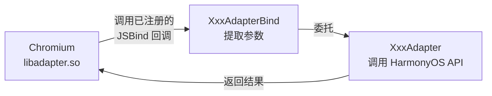

### Wasmer 运行时配置

Wasmer host 在 `electron/src/main/cpp/wasmer_host.cpp` 中配置。启动时会按顺序尝试加载：

1. `libwasmer.so`
2. `/data/storage/el2/base/files/wasmer/libwasmer.so`
3. `/data/storage/el2/base/files/libs/libwasmer.so`

`runWasiModule()` 默认把 `/data/storage/el2/base/files/wasmer/workspace` 作为 WASI preopen 目录，并设置：

| 环境变量 | 默认值 |
|----------|--------|
| `HOME` | workspace 路径 |
| `TMPDIR` | workspace 路径 |
| `OHCODE_WASMER` | `1` |

构建 Wasmer：

```bash
export OHOS_NDK_HOME=/path/to/HarmonyOS/native
scripts/build-wasmer-ohos.sh
```

常用覆盖项：

| 需求 | 环境变量 |
|------|----------|
| 换 wasmer fork | `WASMER_REPO_URL=https://github.com/Multi-V-VM/wasmer.git` |
| 锁定 commit/分支 | `WASMER_REPO_REF=<commit-or-ref>` |
| 覆盖 Wasmer features | `WASMER_FEATURES=wat,wamr-default,wasi` |
| 指定 Rust OHOS target | `WASMER_OHOS_TARGET=aarch64-unknown-linux-ohos` |
| 指定输出 ABI 目录 | `OHCODE_ABI=arm64-v8a` |

> ⚠️ 修改 C++ 或替换 `libwasmer.so` 后需在 DevEco Studio 中 **Clean → Rebuild** 才能生效。

### HNP 打包与注入

HNP（HarmonyOS Native Package）是鸿蒙原生工具链的分发格式。OHcode 通过 HNP 分发 `node`、`bash`、`rg`、`electron` 等运行时。

**构建流程**：

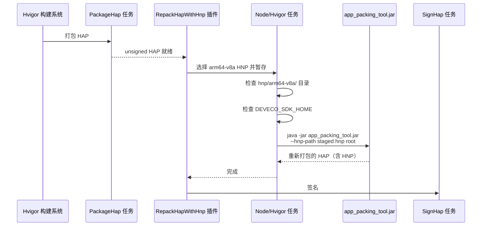

**添加新的 HNP 包**：将 `.hnp` 文件放入 `electron/hnp/arm64-v8a/`。默认 ABI 是 `arm64-v8a`。

**当前 HNP 包**：

| 包 | 大小 | 说明 |
|----|------|------|
| `node.hnp` | 52 MB | Node.js 运行时 |
| `electron.hnp` | 10 MB | Electron 主进程 |
| `bash.hnp` | 1.2 MB | Bash shell |
| `rg.hnp` | 1.8 MB | ripgrep 搜索工具 |

> 🔑 前提：`DEVECO_SDK_HOME` 环境变量必须正确指向 SDK 路径，否则脚本无法找到 `app_packing_tool.jar`。

### 文件关联与打开方式

OHcode 注册了 28+ 种文件类型的「用 OHcode 打开」关联（`module.json5` 中 `scheme: "file"` + `linkFeature: "FileOpen"`）。

**处理流程**：

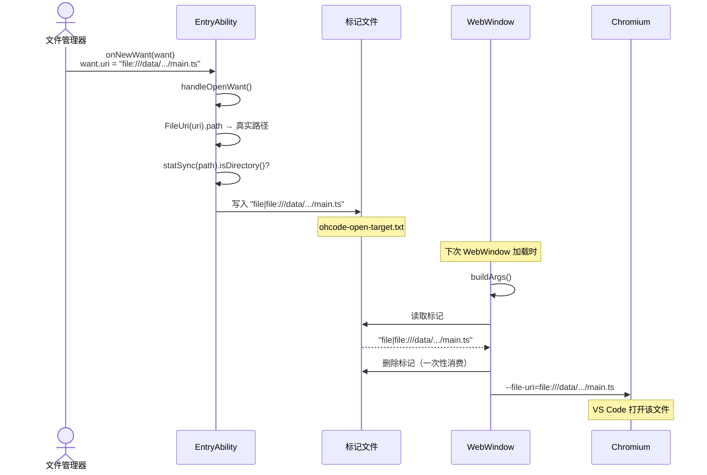

**注册的文件类型**（覆盖主流开发语言）：

| 类别 | UTD 类型 |
|------|---------|
| 通用文本 | `general.text`, `general.plain-text`, `general.log` |
| 源代码 | `general.source-code`, `general.script`, `general.c-source` … |
| Web | `general.java-script`, `general.type-script`, `general.css`, `general.html` |
| 配置 | `general.json`, `general.yaml`, `general.xml`, `general.conf` |
| 文档 | `general.markdown`, `general.diff` |
| 数据 | `general.comma-separated-values-text`, `general.tab-separated-values-text` |
| 学术 | `org.tug.tex`, `org.tug.bib`, `org.tug.cls` |

**支持扩展**：在 `module.json5` 的 `uris` 数组中添加新的 UTD 即可支持更多文件类型，无需修改代码。

### 代码风格与约定

| 约定 | 说明 |
|------|------|
| **Adapter 模式** | 每个 Adapter 是 `@injectable()` 单例，封装 HarmonyOS API；Bind 文件只做接线（提取参数 → 委托 Adapter）|
| **`import lazy`** | `AdapterModule.ets` 中使用 lazy import 延迟加载 Adapter 类，减少启动开销 |
| **`reflect-metadata`** | 在 `BaseAdapter` 中导入，为 Inversify 装饰器提供运行时元数据 |
| **版权头** | 所有源文件保留华为 BSD 风格版权声明 |
| **日志** | 使用 `LogUtil` + `TAG` 常量；`LogDecorator.ts` 提供 `@LogMethod` 自动日志装饰器 |
| **窗口 ID** | 字符串类型（`'browser1'` 等），由 `AbilityManager` + `ConfigData` 管理，数字 ID 自动归一化为 `browserN` 格式 |
| **标记文件** | 跨组件通信使用一次性标记文件——写入方创建，消费方读取后立即删除，保证不残留 |

---

## 📡 通信机制

OHcode 中有多层通信机制，理解它们对开发至关重要：

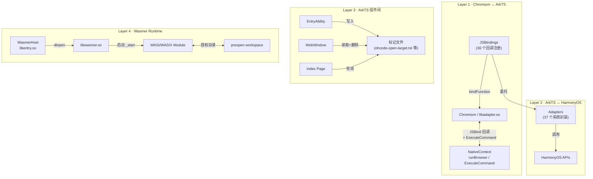

**标记文件协议**（Layer 3 详情）：

| 标记文件 | 写入方 | 消费方 | 格式 | 生命周期 |
|---------|--------|--------|------|---------|
| `ohcode-open-target.txt` | `EntryAbility` | `WebWindow.buildArgs` | `kind\|file://path` | 写入 → 读取 → 删除（一次性） |
| `ohcode-remote-target.txt` | Remote SSH 扩展 | `WebWindow.buildArgs` | `vscode-remote://...` | 写入 → 读取 → 删除（一次性） |
| `ohcode-ready.flag` | `ohcode-splash` 扩展 | `Index` 页面 | （空文件） | 写入 → 轮询到 → 删除 |

---

## 🔐 权限说明

OHcode 需要以下系统权限（`module.json5` 中声明）：

| 权限 | 级别 | 用途 |
|------|------|------|
| `ALLOW_WRITABLE_CODE_MEMORY` | kernel | Wasmer JIT 后端可执行内存；默认 WAMR 解释器路径可继续评估移除 |
| `ALLOW_DEBUG` | kernel | 调试支持 |
| `READ_WRITE_USER_FILE` | system | 读写用户文件（编辑器核心能力） |
| `INTERNET` / `GET_NETWORK_INFO` | normal | 网络访问（扩展市场、Remote SSH） |
| `ACCESS_CERT_MANAGER` | system | 证书管理（HTTPS 客户端证书） |
| `RUNNING_LOCK` | normal | 防止系统休眠（长时间构建/运行） |
| `PRINT` | system | 打印功能 |
| `PREPARE_APP_TERMINATE` | system | 应用退出前清理 |
| `ACCESS_BIOMETRIC` | normal | 生物识别（WebAuthn 认证） |
| `FILE_ACCESS_PERSIST` | system | 持久文件访问 |
| `PRIVACY_WINDOW` | system | 隐私窗口（防止截屏泄露敏感内容） |
| `WINDOW_TOPMOST` | system | 窗口置顶（调试面板等） |

---

## ⚠️ 已知限制与安全注意

### 🟡 功能 WIP

- **OhPty**：`electron/src/main/ets/ohpty/OhPtyChild.ets` 已引入但未调用，`libentry.so:Main` 入口未实现。最终目标是原生 PTY 子进程通过 TCP 39001 提供 VS Code 终端。
- **文件夹打开**：HarmonyOS 文件管理器不支持「用 OHcode 打开文件夹」，需从 OHcode 内部打开。
- **扩展兼容**：VS Code 版本固定在 1.85.2，较新的扩展可能需要通过「Install Specific Version」安装旧版本。

### 🟢 设计约束

- **仅 2in1 / 平板**：`deviceTypes` 为 `2in1` + `tablet`，不支持手机。
- **Wasmer in-process**：WASM 运行时加载在应用进程内；`libwasmer.so` 崩溃会影响整个应用。
- **aarch64-only**：当前构建和预构建 HNP/native 产物都走 `arm64-v8a`。

---

## 🗺️ 路线图

- [ ] 🔒 Host Command Bridge 命令白名单
- [ ] 🖥️ OhPty 原生 PTY 子进程实现
- [ ] 📦 Extension Host 兼容性改进
- [ ] 🎨 主题/外观适配优化
- [ ] 🔄 Remote SSH 稳定性增强
- [ ] 📱 自适应布局（平板竖屏适配）

---

## 🤝 参与贡献

欢迎贡献代码！请遵循以下流程：

1. **Fork** 本仓库
2. 创建功能分支：`git checkout -b feat/your-feature`
3. 遵循[代码风格与约定](#代码风格与约定)
4. 确保在 DevEco Studio 中构建通过
5. 提交 PR，描述清楚变更内容和动机

**Commit 规范**：`类型: 简短描述`

| 类型 | 用途 |
|------|------|
| `feat` | 新功能 |
| `fix` | 修复 Bug |
| `refactor` | 重构 |
| `docs` | 文档 |
| `test` | 测试 |
| `chore` | 构建/工具变更 |

---

<div align="center">

**OHcode** — 让 HarmonyOS PC 有更得心应手的编辑体验 ✨

</div>
